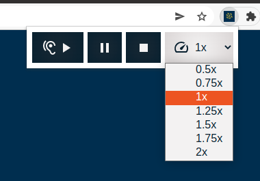

# WebRICE chrome extension

This is a chrome extension inspired by [WebRICE](https://github.com/cadia-lvl/WebRICE/)

The extension enables Icelandic audiences to listen to the web instead of reading it.

## Development

The code used is pure javascript, HTML and CSS.

Instructions on how to debug, test and develop chrome extensions see [Chrome Extensions](https://developer.chrome.com/docs/extensions/)

The extension is using manifest version 3.

## Usage

This extension allows you to convert any text in icelandic into speech. The usage is simple. Select the text you wish to convert, open the extension pop-up and click play. The player also has the basic controls of pause, stop and playback speed.

The player:

The speed rate dropdown:

## License

This project is licensed under [Apache 2.0](LICENSE).

## Authors/Credit

[Reykjavik University](https://ru.is)

- Staffan Hedstöm [staffanh@ru.is](mailto:staffanh@ru.is)

## Acknowledgements

This project was funded by the Language Technology Programme for Icelandic 2019-2023. The programme, which is managed and coordinated by [Almannarómur](https://almannaromur.is/), is funded by the Icelandic Ministry of Education, Science and Culture.

We use icons created from [Material Design](https://www.material.io/).

This project has taken some inspiration from an unfinished firefox extension developed by:

- Smári Freyr Guðmundsson
- Safa Jmai
